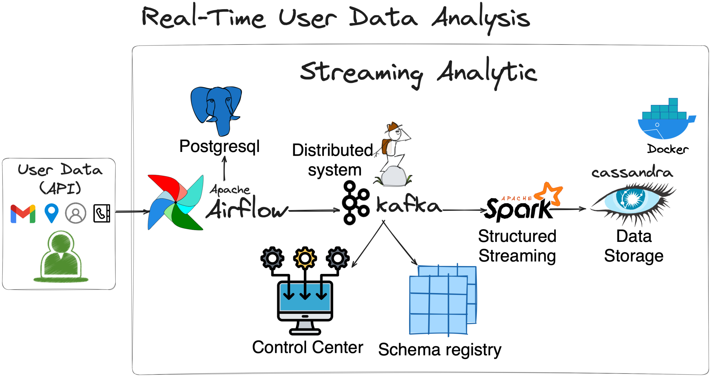
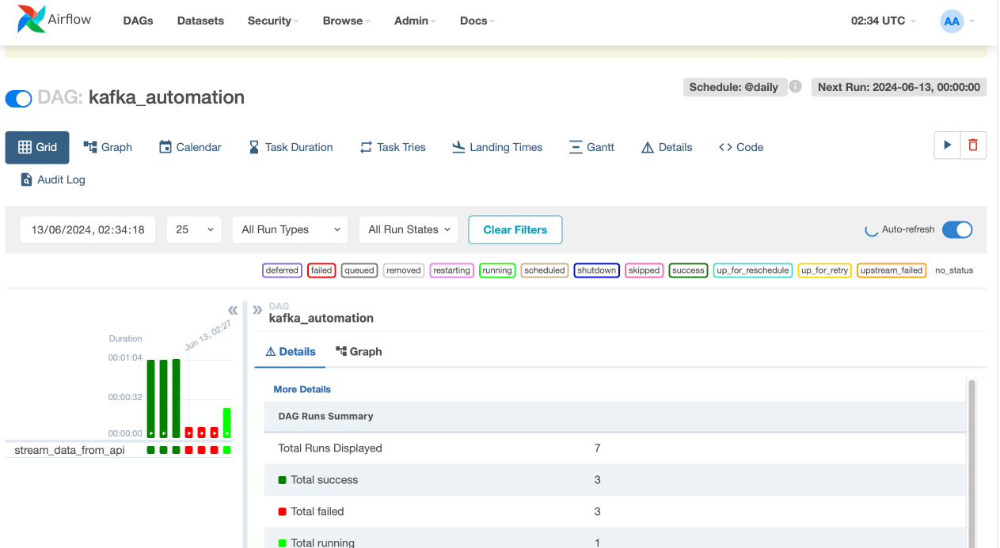
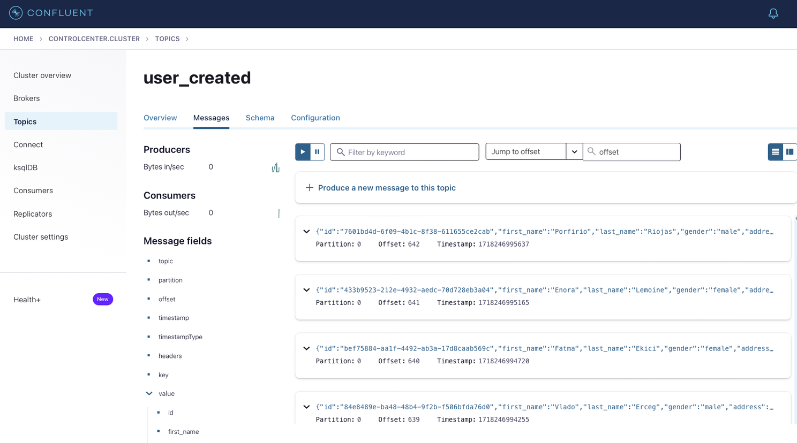
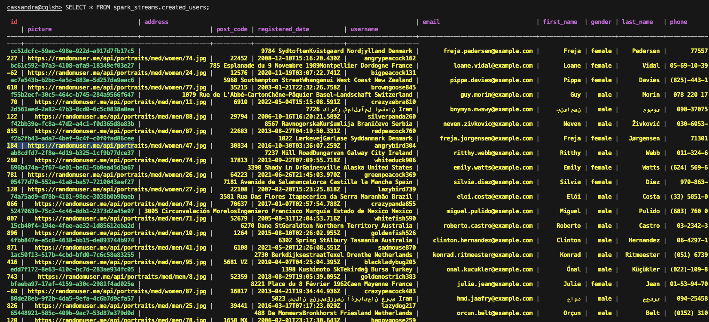

# Transforming User Insights: Real-Time Data Analysis with Kafka, Spark, PostgreSQL, Docker and Cassandra

My linkedin: [tuanduong284](https://linkedin.com/in/tuanduong284)

In today's data-driven world, real-time data analysis is crucial for businesses to make informed decisions swiftly. Our processing system harness <b>Kafka</b>, <b>Spark</b>, <b>PostgreSQL</b>, <b>Docker</b> and <b>Cassandra</b>.

<p align="center">
  
</p>

## The Challenge

Manually inputting data and updating systems later leads to outdated insights, as traditional systems struggle with increasing data volumes, resulting in performance bottlenecks and higher costs. 

Integrating data from various sources often causes inconsistencies and complexities, compromising data quality and delaying analytics. 

Without real-time monitoring and processing tools, issues may go undetected, leading to data loss or corruption. Inefficient storage solutions further exacerbate these challenges, causing high retrieval latency and increased costs.

## Main Tasks

The project aims to establish a real-time data analysis system for capturing and processing user data efficiently by leveraging advanced technologies and a robust data pipeline:

- <b>Enhanced Data Capture:</b> Real-time ingestion to capture user interactions as they happen, reducing latency.
- <b>Scalable Architecture:</b> A distributed system to handle growing data volumes seamlessly.
- <b>Improved Data Quality:</b> Ensuring integrity and accuracy through schema management and real-time validation.
- <b>Streamlined Operations:</b> Automating workflows to minimize manual intervention and reduce errors.
- <b>Comprehensive Monitoring:</b> Tools to monitor data stream health and resolve issues promptly.
- <b>Business Integration:</b> Real-time insights integrated into business applications for immediate action.
- <b>Data-Driven Decisions:</b> Providing stakeholders with timely, actionable insights for informed decision-making.

## Getting Started

###  Project file:

- `kafka_stream.py`: [kafka_stream.py](dags/kafka_stream.py) is created to fetches user data from [Api_randomuser](https://randomuser.me), processes and streams into a Kafka topic named `user_created`. The DAG in <b>Apache Airflow</b> employs PythonOperator to handle the task execution. 

- `spark-streaming.py`:  [spark-streaming.py](spark-streaming.py) is builded to create `cassandra_keyspace`, `cassandra_table`, `cassandra_connection`, `spark_connection`, `connect_to_kafka` and interation between them.

### Running project:

1- Clone the repository:

```
git clone https://github.com/ntd284/streaming_realtime_data.git
```

2- Navigate to the project directory

```
cd streaming_realtime_data
```

3- Set Up a Virtual Environment in Python

```
pip3 install virtualenv
python3 -m venv venv
source venv/bin/activate
```

4- Install the needed packages and libraries:

```
pip3 install -r ./requirements.txt
```

5- Install Docker, Docker compose:

```
sudo ./installdocker.sh
docker --version
docker compose version
```

6- Build docker:

```
docker compose up -d
```

7- Run step by step files:

```
python3 spark-streaming.py
```

8- Access to airflow UI to monitor streaming process: `localhost:8080` with account: `admin`, password: `admin`

<p align="center">
  
</p>

9- Access to `control center UI` monitor Topic health, Procuder and consumer performance, Offset, Cluster health: `localhost:9021`

<p align="center">
  
</p>

10- Check data in `Cassandra` with command:

```
docker exec -it cassandra cqlsh -u cassandra -p cassandra localhost 9042
```

<p align="center">
  
</p>

### Reference:

[1]. [Realtime Data Streaming](https://www.youtube.com/watch?v=GqAcTrqKcrY)

[2]. [Cassandra and pyspark](https://medium.com/@yoke_techworks/cassandra-and-pyspark-5d7830512f19)

<b> ⚡️That's all for my project, thanks for watching. If you have any question, don't hesitate inbox me.⚡️</b>